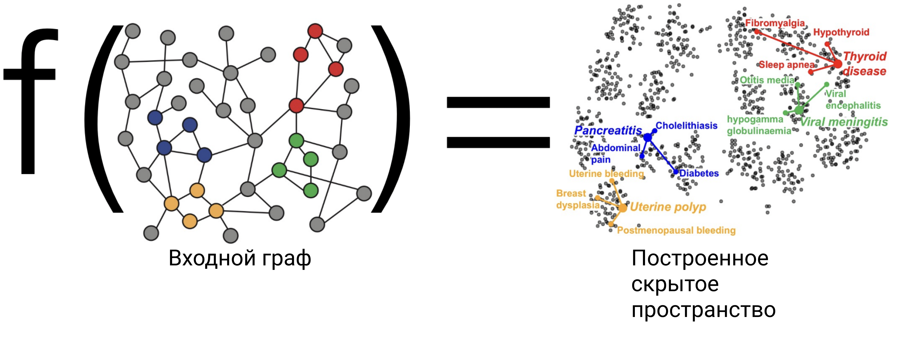
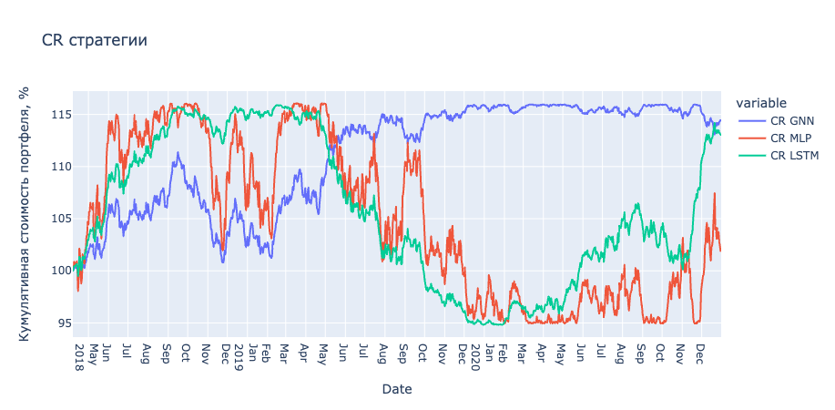

- [Обзор задач](#обзор-задач)
- [Введение](#введение)
- [Базовые идеи графовых нейронных сетей](#базовые-идеи-графовых-нейронных-сетей)
- [Задачи, решаемые с помощью графовых гейронных сетей](#задачи-решаемые-с-помощью-графовых-гейронных-сетей)
  - [Классификация вершин графа](#классификация-вершин-графа)
  - [Классификация непосредственно графа](#классификация-непосредственно-графа)
- [Итог обзора арзитектуры  графовых нейронных сетей](#итог-обзора-арзитектуры--графовых-нейронных-сетей)
- [Задача предсказания трендов отдельных акций, деривативов](#задача-предсказания-трендов-отдельных-акций-деривативов)
- [Определения](#определения)
  - [**Концепции акций**](#концепции-акций)
  - [**Ценовой тренд акций**](#ценовой-тренд-акций)
  - [**Непосредственно задача**](#непосредственно-задача)
- [Архитектура модели](#архитектура-модели)
- [Целевая функция](#целевая-функция)
- [Обзор результатов стратегии](#обзор-результатов-стратегии)
  - [Описание эксперимента](#описание-эксперимента)
  - [Метрика](#метрика)
    - [**Information Coefficient (IC)**](#information-coefficient-ic)
    - [**Rank IC**](#rank-ic)
  - [Подходы для сравнения:](#подходы-для-сравнения)
  - [Результаты](#результаты)
    - [**Метрики**](#метрики)
    - [**Кол-во парамтеров модели**](#кол-во-парамтеров-модели)
- [Выводы](#выводы)
- [Код](#код)
- [Источники](#источники)

## Обзор задач 

​	В современном мире исследователи всё чаще сталкиваюится с данными, по структуре представляющими собой некоторый граф, это могут быть например данные о пользователях в социальных сетях, где рёбрами будут связи между пользователями, а вершиными будут пользователи или же информация об устрвйстве молекул, тогда в вершинах будут некоторые структурные элементы молекул (атомы, ионы и так далее).

## Введение 

​	При этом классические методы машинного обучения хоть и могут решать задачи с подобными данными, скрытое их представление в результате работы классических алгоритмов кодирования с помощью нейронных сетей не гарантирует сохранение взаимных отношений скрытых представленний соответстующих вершин графа. Для лучшего решения задач с данными в виде графов предлагается использовать так называемые графовые нейронные сети, основная задача которых – правильно построение скрытого пространва.

## Базовые идеи графовых нейронных сетей 

В рассмотрении задачи обучения графовой нейронной сети рассматривают следующие параметры:
- $\mathcal{G} = (\mathcal{V}, \mathcal{E})$ непосредственно входной граф 
- $\mathbin{X} \in \mathbb{R}^{d \times |\mathcal{V}|}$ – множество признаков
- $\mathbin{z}_u \forall u \in \mathcal{V}$ – скрытое представление исходных вершин графа 
  
Обновление информации о скрытом преддставлении вершин графа можно предстваить следующим образом: 
$$h^{(k+1)}_u = \text{UPDATE}^{(k)}(h_u^{(k)}, \text{AGGREAGATE}^{(k)}(\{h_v^{(k)}, \forall v \in \mathcal{N}(u)\}) = \\ \text{UPDATE}^{(k)}(h_u^{(k)}, m^{(k)_{\mathcal{N}(u)}})$$
Таким образом для операции обновления для $\mathbin{h}_u^{(k)}$ происходят исходя из аггрегированной информации о соседях $\mathbin{u}$ в графе, обозначим множнство соседей $\mathbin{u}$ через $\mathcal{N}(u)$
На каждом шаге $\text{AGGREGATE}$ функция принимает в качестве входа $\mathcal{H}(t) = \{\mathbin{h}_u, \forall u \in \mathcal{N}(t)\}$ и генерирует информационное "сообщение" $\mathbin{m}_{\mathcal{N}(t)}^{(k)}$,  далее функиця $\text{UPDATE}$ комбинирует $\mathbin{m}_{\mathcal{N}(t)}^{(k)}$ и $\mathbin{h}_t^{(k-1)}$ для создания $\mathbin{h}_t^{(k)}$. На нулевом шаге $\mathbin{h}_t^{(0)} = \mathbin{x}$. В результате процесса обработки графа имеем множество скрытых представлений 
$$\mathbin{z}_u = \mathbin{h}_u^{(K)}, u \in \mathcal{V}$$

Итоговый проход графовой нейронной сети можно описать следующим образом
$$
    \mathbin{h}_u ^ {(k)} = \sigma (\mathbin{W}_{self}^{(k)}) \mathbin{h}_{u}^{(k-1)} + \mathbin{W}_{neigh}^{(k)} \sum_{\mathcal{v} \in \mathcal{N}(u)}{\mathbin{h}_{\mathcal{v}}^{(k-1)}} + \mathbin{b}^{(k)}
$$
Где $\mathbin{W}_{self}^{(k)}, \mathbin{W}_{neigh}^{(k)} \in \mathbb{R}^{d^{(k)} \times d^{(k-1)}}$ – обучаемые параметры 
таким образом операцию обновления можно описать как $\text{UPDATE}(\mathbin{h}_{u}), \mathbin{m}_{\mathcal{N}(u)}) = \sigma(\mathbin{W}_{self}\mathbin{h}_u+\mathbin{W}_{neigh}\mathbin{m}_{\mathcal{N}(u)})$, где, напомню, $m_{\mathcal{N}(u)}=\text{AGGREGATE}^{(k)}(\{\mathbin{h}_{v}^{(k)}, \forall v \in \mathcal{N}(u)\})$.
## Задачи, решаемые с помощью графовых гейронных сетей 

### Классификация вершин графа 
Часто в различных задачах построения, например, рекомедательных систем (рекомендация друзей в социальных сетях) необходимо каким либо образом классифицировать вершины графа, относя их к тому или иному классу. Данную задачу можнон неплохо решать с помощью классических подходов задач классификации, но они никак не будут учитывать взаимные отношения между участниками графа. Данная проблема удачно решается с помощью применения графовых нейронных сетей. 

Тогда функциоал ошибки можно описать следующим образом: 
$$\mathcal{L}=\sum_{u \in \mathcal{V}_{\text {train }}}-\log \left(\operatorname{softmax}\left(\mathbf{z}_{u}, \mathbf{y}_{u}\right)\right)$$

### Классификация непосредственно графа 
Также порой необхожимо классифицировать не отдельные вершины сети, а всю сеть целиком. Например, это может применяться в задачи классификации молекул, или в задаче классификации отдельных сетей пользователей. 

Тогда функционал ошибки описывается следующим образом: 
$$
\mathcal{L}=\sum_{\mathcal{G}_{i} \in \mathcal{T}}\left\|\operatorname{MLP}\left(\mathbf{z}_{\mathcal{G}_{i}}\right)-y_{\mathcal{G}_{i}}\right\|_{2}^{2}
$$
Где $\text{MLP}$ – полносвязная нейросеть, построенная над скрытым представление вершин графа $\mathbin{z}_{\mathcal{G}}$

## Итог обзора арзитектуры  графовых нейронных сетей 
Особенности и отличия Графовых Нейроннных Сетей от классических методов глубокого обучения:
- Графовые Нейронные сети строятся как система распространения информации по графу; число слоев = глубина обхода
- Графовые Нейронные сети это совместное обучение структуры с признаками вершин
- Графовые Нейронные сети это обучение с учителем, под конкретную задачу
- Размер модели Графовой Нейронной сети почти не зависит от размера графа

---
## Задача предсказания трендов отдельных акций, деривативов 
Фондовый рынок - один из самых прибыльных инвестиционных каналов в реальном мире. Чтобы добиться высокой доходности в последние годы привлекает все большее внимание как фундаментальный компонент многих сложных инвестиционных стратегий. Многие из существующих подходов предполагают, что цены на различные акции независимы друг от друга, и модель прогнозирования строятся просто на основе информации, относящейся к каждой акции по отдельности, такой как временные ряды исторических цен и объема акций.
Однако на практике ценовые тренды различных акций, как правило, сильно коррелируют друг с другом, особенно акции из обного сектора или разделяющие общие выскоуровневые концепции. 
Многие недавние исследования обращают особое внимание на использование такой информации в прогнозировании фондовых тенденций. Например, некоторые простые методы напрямую использовали предопределенные концепции акций в качестве входных параметров модели линейного прогнозирования.

## Определения 
### **Концепции акций** 

    Предопределенные концепции акций - это
    некоторые определяемые человеком концепции акций, такие как сектор акций, отрасль и основные предприятия. Скрытые концепции акций - это некоторые скрытые концепции, которые эксперты-люди не определяют заранее и отражают некоторую аналогичную тенденцию цен на акции среди акций в рамках одной и той же скрытой концепции.
Например: 

    Возьмём 4 акции: Apple, Microsoft, Amazon, eBay. В итоге  имеем 4 явных концепта: Технологический сектор, Электронная коммерция, Облачные вычисления, Интернет ретейлеры. В итоге для Microsoft имеем имеет два явных концета Технологический сектор и Облачные вычисления.

### **Ценовой тренд акций**
$$d_{i}^{t}=\frac{\text { Price }_{i}^{t+1}-\text { Price }_{i}^{t}}{\text { Price }_{i}^{t}}$$
    

### **Непосредственно задача**
Имея некоторую информацю об акции (историческая стоимость, объём, текстовая информация из новостей и соцсетей) для акции $A_i$ на момент времени $t$ уметь предсказывать ценовой тренд акции $d_i^t$.

## Архитектура модели 

Модель состаит из 3 принцципиальных блоков.
1. Блок для извлечения сырой информации, это различные временные прищнаки, обработанные признаки из открытых источников 
2. Блок для извлечения скрытых концептов, графовая нейросеть, которая извлекает некоторые скрытые концепты, взаимосвязи между акциями. 
3. Регрессионный модуль для предсказания тренда 

## Целевая функция
$$\mathcal{L}=\sum_{t \in \mathcal{T}} \operatorname{MSE}\left(p^{t}, d^{t}\right)=\sum_{t \in \mathcal{T}} \sum_{i \in \mathcal{S}^{t}} \frac{\left(p_{i}^{t}-d_{i}^{t}\right)^{2}}{\left|\mathcal{S}^{t}\right|}$$
   
- $\mathcal{T}$ – множество рассматриваемых дат 
- $\mathcal{S}^t$ – множество акций на день $t$
- $p_i^t, d_i^t$ – предсказанные и целевые тренды акции $i$ в день $t$

## Обзор результатов стратегии

### Описание эксперимента

Предлагается сравнить различные подходы для предсказания тренда акций на примере индекса [CSI 100](https://en.wikipedia.org/wiki/CSI_100_Index). Данный индекс включает в себя 100 китайских компаний с наибольшей рыночной капитализацией, торгующихся на Китайских (Шанхайская и Шеньдженьская) биржах с  01/01/2017 по 12/31/2020. 

### Метрика
Для оценки качества стратегии используется несколько различных метрик, как статистических, так эмпирических 

1. Information Coefficient (IC)
2. Rank IC
3. Precision@N $N\in\{3,5,10,30\}$

#### **Information Coefficient (IC)**
Данная метрика выражается как мера корреляции Пирсона между целевой переменной и предсказанием 
$$r_{x y}=\frac{\sum_{i=1}^{m}\left(x_{i}-\bar{x}\right)\left(y_{i}-\bar{y}\right)}{\sqrt{\sum_{i=1}^{m}\left(x_{i}-\bar{x}\right)^{2} \sum_{i=1}^{m}\left(y_{i}-\bar{y}\right)^{2}}}=\frac{\operatorname{cov}(x, y)}{\sqrt{s_{x}^{2} s_{y}^{2}}}$$

#### **Rank IC**
Вычисляется по формуле $\operatorname{Rank} \operatorname{IC}\left(y^{t}, \hat{y}^{t}\right)=\operatorname{corr}\left(\operatorname{rank}_{y}^{t}, \operatorname{rank}_{\hat{y}}^{t}\right)$, где $\operatorname{corr}(\cdot)$ – коэффициент корреляции пирсона. Далее в каждый день $t$ предсказагния и целевая переменная сортируются по возрастанию тренда акции. 

### Подходы для сравнения: 
Для сравнения качества графовой нейронной сети применяются два других распространённых подхода. 
1. MLP модель 
2. LSTM модель 

### Результаты 

#### **Метрики**

|              | GNN    | MLP    | LSTM   |
|--------------|--------|--------|--------|
| IC           | **0.120**  | 0.0071 | 0.0097 |
| Rank IC      | **0.115**  | 0.0061 | 0.0091 |
| Precision@10 | **0.6107** | 0.5549 | 0.5904 |

#### **Кол-во парамтеров модели**

- GNN - 1 000 000 
- MLP – 300 000 000 
- LSTM – 50 000 000

## Выводы
Графовые сети благодаря особому подходу к структурированным данным могут быть использованы во множесте областей, начиная с классификации молекул и заканчивая построением алгоритмической стратегии. Особенное принаковое пространство позволяет работать не с отдельными элементами выборки, а с выборокой в целом, учитывая взаимные отношения отдельных элементов выборки. 
Особенно хорошо себя показывают графовые нейронные сети в задачах среднесрочной алгоритмической торговли, за счёт того, что позволяют аггрегировать разрозненную информацию об отдельных акциях, выстраивая некоторые скрытые признаки, объединяющие отдельные деривативы. 

## Код 
[GitHub]()
## Источники
1. Graph Representation Learning 
2. Stanford, cs224w
